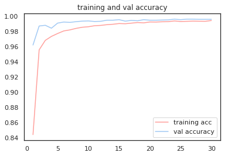
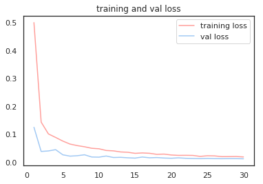
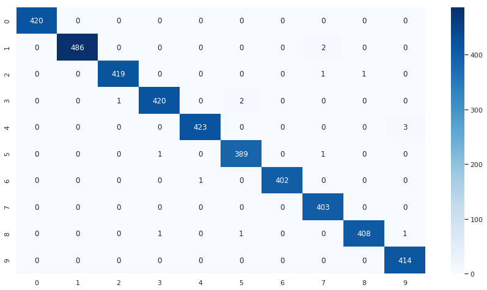

# Digit Recognizer with TensorFlow 2.0

[Kaggle](https://www.kaggle.com/)'s classic digit recognizer competition using TensorFlow 2.0 and Google Colab.

The most recent state of the art approach achieved a 99.79% accuracy. This implementation achieved a 99.62% accuracy. Further improvements could be made in the following way:

* Hyperparameter optimization
* Weight regularization
* Add noise to generated images

## Design Decisions

* `ImageDataGenerator` is used to create batch tensor images with real-time data augmentation. Augmentations include rotation up to 10° and a 0.1 range for width, height, and zoom adjustments.

* `LearningRateScheduler` is used as a callback to decrease the learning rate after every epoch. Similar results were seen with `ReduceLROnPlateau`, which is a more interesting annealer that reduces the learning rate when the model stagnates.
* `Adam` is used for the model's optimizer with a `0.0001` learning rate. `RMSProp` was tested but didn't perform as well.

Here's a summary of the model:

```
Model: "sequential"
_________________________________________________________________
Layer (type)                 Output Shape              Param #   
=================================================================
conv2d (Conv2D)              (None, 26, 26, 32)        320       
_________________________________________________________________
batch_normalization (BatchNo (None, 26, 26, 32)        128       
_________________________________________________________________
conv2d_1 (Conv2D)            (None, 24, 24, 32)        9248      
_________________________________________________________________
batch_normalization_1 (Batch (None, 24, 24, 32)        128       
_________________________________________________________________
conv2d_2 (Conv2D)            (None, 12, 12, 32)        25632     
_________________________________________________________________
batch_normalization_2 (Batch (None, 12, 12, 32)        128       
_________________________________________________________________
dropout (Dropout)            (None, 12, 12, 32)        0         
_________________________________________________________________
conv2d_3 (Conv2D)            (None, 10, 10, 64)        18496     
_________________________________________________________________
batch_normalization_3 (Batch (None, 10, 10, 64)        256       
_________________________________________________________________
conv2d_4 (Conv2D)            (None, 8, 8, 64)          36928     
_________________________________________________________________
batch_normalization_4 (Batch (None, 8, 8, 64)          256       
_________________________________________________________________
conv2d_5 (Conv2D)            (None, 4, 4, 64)          102464    
_________________________________________________________________
batch_normalization_5 (Batch (None, 4, 4, 64)          256       
_________________________________________________________________
dropout_1 (Dropout)          (None, 4, 4, 64)          0         
_________________________________________________________________
flatten (Flatten)            (None, 1024)              0         
_________________________________________________________________
dense (Dense)                (None, 256)               262400    
_________________________________________________________________
dropout_2 (Dropout)          (None, 256)               0         
_________________________________________________________________
dense_1 (Dense)              (None, 10)                2570      
=================================================================
Total params: 459,210
Trainable params: 458,634
Non-trainable params: 576
```

Here are plots that show model accuracy and loss. Overall, the model performs well and isn't overfitting. 

|              Accuracy              |            Loss            |
| :--------------------------------: | :------------------------: |
|  |  |

Digging in deeper, a confusion matrix reveals some of the network's weak points. Notably, it fails to interpret some nines, sevens and fives.  

