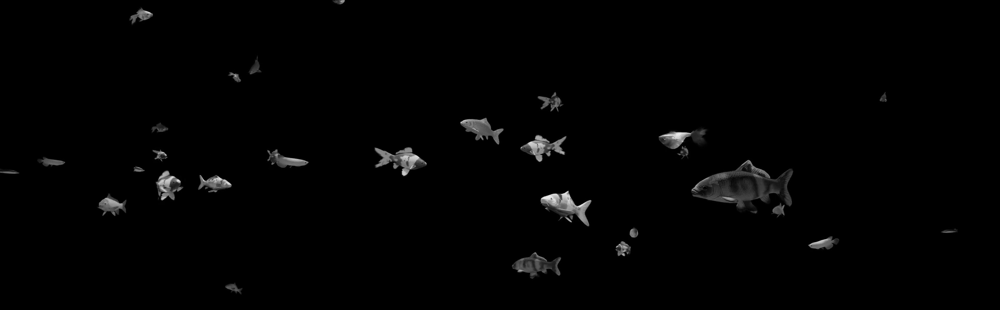
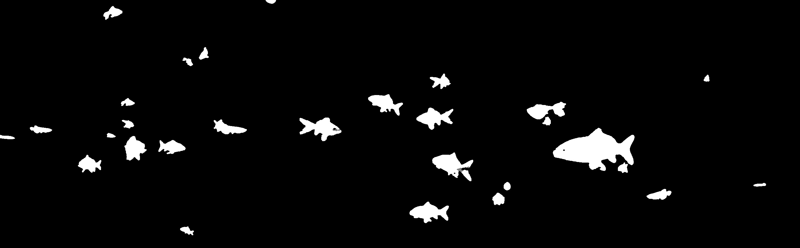
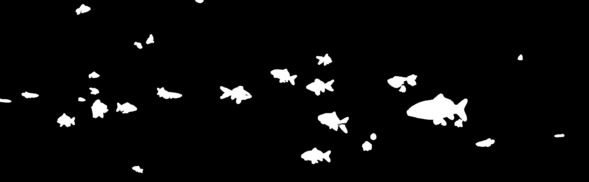

# Multi Object Video Tracking with OpenCV

Multi object tracking with the Open Source Computer Vision (OpenCV) library.

## Dependencies

* OpenCV
* Numpy

## Installation

Install dependencies with Pipenv.

```bash
$ pipenv install
```

Run `experiment.py`.

```bash
$ python experiment.py
```

## Results

Here are the results using background subtraction, morphological transformations and contour detection.


### Morphological transformations

Before contours are detected, the gray scale image undergoes a series of morphological transformations. First, it's eroded and then dilated.  detection, each frame is treated with a series of morphological transformations.

#### BGR to Gray



#### Closing

Frame is dilated and then eroded. This closes black points within foreground objects.


#### Opening

Frame is eroded and then dilated. This removes noise around the foreground object.



#### Dilation

Increase the size of the foreground object. This is useful for joining broken parts of an object.


